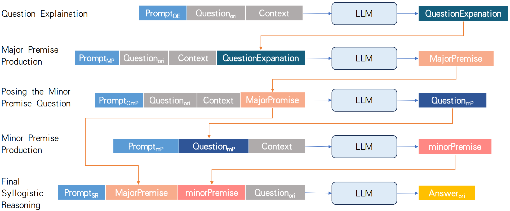

# SR-FoT
This is the official implementation of the paper "[SR-FoT: A Syllogistic-Reasoning Framework of Thought for Large Language Models Tackling Knowledge-based Reasoning Tasks](https://ojs.aaai.org/index.php/AAAI/article/view/33666)" (AAAI 2025). 



SR-FoT is a 5-stage Framework of Thought based on the Syllogistic-Reasoning paradigm (as shown in the figure above), requiring no training. Its purpose is to guide Large Language Models (LLMs) to perform syllogistic deductive reasoning, thereby enhancing their reasoning capabilities, particularly the rigor of reasoning. We validated the advantages of our method over approaches like Chain-of-Thought (CoT),  on knowledge-based reasoning and question-answering tasks using several state-of-the-art (both closed-source and open-source) LLMs at the time.


## Requirements

First, download and set up the repo:

```setup
git clone https://github.com/RodeWayne/SR-FoT.git
cd SR-FoT
```

## Data Preparation
Download the dataset of ScienceQA, StrategyQA, and BoolQ from their official website. For ScienceQA, filter the data items that don't need images. 

## Evaluation
Cause our SR-FoT is a training-free method, so we only need to do the evaluation to get the experimental results. 

### Get Answer
For no matter closed-source and open-source LLMs, we use an api to access the response of the LLM for the questions. For Example, for ScienceQA, to get the answer response from GPT-3.5-turbo, DeepSeek-V2, and Qwen-1.5-32B-Chat using our SR-FoT, run this command:

```
cd answer_generate
python Syllogism_scienceQA.py
python Syllogism_scienceQA_deepseek.py
python Syllogism_scienceQA_qwen.py
```
For ScienceQA, to get the answer response from GPT-3.5-turbo, DeepSeek-V2, and Qwen-1.5-32B-Chat using base(without CoT prompt) or CoT, run this command:
```
cd answer_generate
python base_cot_scienceQA.py
python base_cot_scienceQA_deepseek.py
python base_cot_scienceQA_qwen.py
```
Other datasets can be processed similarly by running the Python files with the corresponding file names. The prompts used for base, CoT, and our SR-FoT methods can be found in the corresponding files under ./prompt directory.

### Calculate Accuracy
After getting the answer, run the commands below to calculate the accuracy (for example: ScienceQA):
```
cd cal_acc
python cal_acc_scienceQA_syllogism.py
```

## Citation

If you find this code useful in your research, please consider citing:

``` citation
@inproceedings{wan2025sr,
  title={SR-FoT: A Syllogistic-Reasoning Framework of Thought for Large Language Models Tackling Knowledge-based Reasoning Tasks},
  author={Wan, Wentao and Yang, Zhuojie and Chen, Yongcan and Luo, Chenglin and Wang, Ruilin and Cai, Kehao and Kang, Nan and Lin, Liang and Wang, Keze},
  booktitle={Proceedings of the AAAI Conference on Artificial Intelligence},
  volume={39},
  number={14},
  pages={15186--15194},
  year={2025}
}
```

